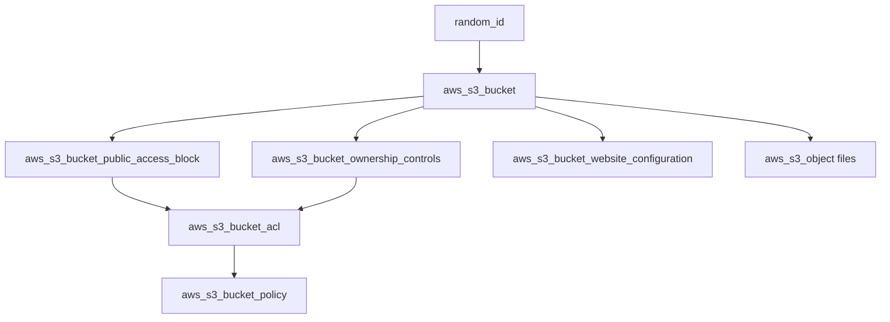

# 🔧 Terraform Infrastructure Documentation

Detailed technical documentation for the Villa Website Hosting Terraform configuration.

## 🏗️ Infrastructure Components

### Core Resources

| Resource | Purpose | Configuration |
|----------|---------|---------------|
| `aws_s3_bucket` | Main storage bucket | Static website hosting enabled |
| `aws_s3_bucket_public_access_block` | Public access settings | All blocks set to `false` |
| `aws_s3_bucket_ownership_controls` | Bucket ownership | `BucketOwnerPreferred` |
| `aws_s3_bucket_acl` | Access control list | `public-read` |
| `aws_s3_bucket_policy` | Security policy | Public read access |
| `aws_s3_bucket_website_configuration` | Website settings | Index/error documents |
| `aws_s3_object` (50+) | File uploads | Individual file resources |

### Resource Dependencies



## 📋 Configuration Details

### S3 Bucket Configuration

```hcl
resource "aws_s3_bucket" "website_bucket" {
  bucket = "villa-website-hosting-${random_id.bucket_suffix.hex}"
}
```

**Features:**
- **Unique Naming**: Random suffix prevents conflicts
- **Region**: `us-east-1` (configurable)
- **Versioning**: Disabled (static content)
- **Encryption**: AES256 (default)

### Public Access Configuration

```hcl
resource "aws_s3_bucket_public_access_block" "website_bucket" {
  bucket = aws_s3_bucket.website_bucket.id

  block_public_acls       = false
  block_public_policy     = false
  ignore_public_acls      = false
  restrict_public_buckets = false
}
```

**Why all `false`?**
- Required for static website hosting
- Allows public read access
- Enables bucket policy application

### Bucket Policy

```hcl
resource "aws_s3_bucket_policy" "website_bucket" {
  policy = jsonencode({
    Version = "2012-10-17"
    Statement = [
      {
        Sid       = "PublicReadGetObject"
        Effect    = "Allow"
        Principal = "*"
        Action    = "s3:GetObject"
        Resource  = "${aws_s3_bucket.website_bucket.arn}/*"
      },
    ]
  })
}
```

**Security Features:**
- **Read-only access**: Only `s3:GetObject` allowed
- **Public access**: `Principal = "*"`
- **Resource scope**: All objects in bucket

### Website Configuration

```hcl
resource "aws_s3_bucket_website_configuration" "website_bucket" {
  bucket = aws_s3_bucket.website_bucket.id

  index_document {
    suffix = "index.html"
  }

  error_document {
    key = "index.html"
  }
}
```

**URL Structure:**
- **Base URL**: `http://bucket-name.s3-website-region.amazonaws.com`
- **Index**: Automatically serves `index.html`
- **Errors**: Redirects to `index.html`

## 📁 File Upload Strategy

### Individual Resource Approach

Each file is uploaded using a separate `aws_s3_object` resource:

```hcl
resource "aws_s3_object" "index_html" {
  bucket       = aws_s3_bucket.website_bucket.id
  key          = "index.html"
  source       = "./index.html"
  content_type = "text/html"
  etag         = filemd5("./index.html")
}
```

### File Categories

| Category | Count | Content Types | Examples |
|----------|-------|---------------|----------|
| HTML | 4 | `text/html` | `index.html`, `contact.html` |
| CSS | 5 | `text/css` | `animate.css`, `bootstrap.min.css` |
| JavaScript | 4 | `application/javascript` | `custom.js`, `jquery.js` |
| Images | 25 | `image/jpeg`, `image/png` | `banner-01.jpg`, `property-01.jpg` |
| Fonts | 8 | `font/ttf`, `font/woff2` | `fa-solid-900.ttf` |

### Content Type Mapping

```hcl
# Automatic content type detection based on file extension
content_type = "text/html"           # .html files
content_type = "text/css"            # .css files
content_type = "application/javascript" # .js files
content_type = "image/jpeg"          # .jpg files
content_type = "image/png"           # .png files
content_type = "font/ttf"            # .ttf files
content_type = "font/woff2"          # .woff2 files
```

## 🔒 Security Configuration

### Public Access Block Settings

| Setting | Value | Purpose |
|---------|-------|---------|
| `block_public_acls` | `false` | Allow public ACLs |
| `block_public_policy` | `false` | Allow public policies |
| `ignore_public_acls` | `false` | Respect public ACLs |
| `restrict_public_buckets` | `false` | Allow public bucket access |

### Ownership Controls

```hcl
resource "aws_s3_bucket_ownership_controls" "website_bucket" {
  rule {
    object_ownership = "BucketOwnerPreferred"
  }
}
```

**Benefits:**
- **ACL Support**: Enables bucket ACL configuration
- **Policy Control**: Allows bucket policy application
- **Compatibility**: Works with legacy ACLs

## 📊 Resource Counts

### Total Resources Created

| Resource Type | Count | Purpose |
|---------------|-------|---------|
| `random_id` | 1 | Unique bucket naming |
| `aws_s3_bucket` | 1 | Main storage bucket |
| `aws_s3_bucket_public_access_block` | 1 | Public access settings |
| `aws_s3_bucket_ownership_controls` | 1 | Ownership configuration |
| `aws_s3_bucket_acl` | 1 | Access control list |
| `aws_s3_bucket_policy` | 1 | Security policy |
| `aws_s3_bucket_website_configuration` | 1 | Website settings |
| `aws_s3_object` | 50+ | File uploads |

**Total**: ~55+ resources

## 🚀 Deployment Process

### 1. Initialization
```bash
terraform init
```
- Downloads AWS provider
- Initializes backend
- Sets up working directory

### 2. Planning
```bash
terraform plan
```
- Validates configuration
- Shows resource changes
- Estimates costs

### 3. Application
```bash
terraform apply
```
- Creates S3 bucket
- Configures public access
- Uploads all files
- Outputs website URL

### 4. Verification
```bash
terraform output
```
- Shows bucket name
- Displays website endpoint

## 🛠️ Troubleshooting

### Common Issues

#### 1. Public Access Block Error
```
Error: putting S3 Bucket Policy: operation error S3: PutBucketPolicy, 
api error AccessDenied: User is not authorized to perform: s3:PutBucketPolicy 
because public policies are blocked
```

**Solution**: Ensure `block_public_policy = false` in public access block.

#### 2. File Not Found Error
```
Error: Error in function call: filemd5("./file.html") failed: 
read ./file.html: no such file or directory
```

**Solution**: Verify all files exist in the correct paths.

#### 3. State Lock Error
```
Error: Error acquiring the state lock
```

**Solution**: Run `terraform force-unlock -force` or wait for lock timeout.

### Debug Commands

```bash
# Validate configuration
terraform validate

# Check state
terraform state list

# Show specific resource
terraform state show aws_s3_bucket.website_bucket

# Refresh state
terraform refresh
```

## 📈 Performance Considerations

### File Upload Optimization

- **Individual Resources**: Each file uploaded separately
- **Parallel Processing**: Terraform uploads files concurrently
- **ETag Validation**: Prevents unnecessary re-uploads
- **Content Types**: Proper MIME types for caching

### S3 Performance

- **Standard Storage**: Fast access for website files
- **CDN Ready**: Can be fronted with CloudFront
- **Regional**: `us-east-1` for optimal performance
- **Caching**: Browser-friendly content types

## 💰 Cost Analysis

### Monthly Costs (Estimated)

| Component | Usage | Cost |
|-----------|-------|------|
| S3 Storage | ~50MB | $0.001 |
| Data Transfer | ~1GB | $0.09 |
| **Total** | | **~$0.10/month** |

### Cost Optimization

- **Storage Class**: Standard (appropriate for website hosting)
- **Lifecycle Policies**: Not needed for static content
- **Versioning**: Disabled to reduce costs
- **Monitoring**: CloudWatch metrics (optional)

## 🔄 Maintenance

### Regular Tasks

1. **Update Dependencies**: Check for Terraform provider updates
2. **Review Security**: Audit bucket policies and access
3. **Monitor Costs**: Check AWS billing dashboard
4. **Backup State**: Store Terraform state securely

### Scaling Considerations

- **CloudFront**: Add for global distribution
- **Custom Domain**: Configure Route 53
- **SSL Certificate**: Add ACM certificate
- **Monitoring**: Set up CloudWatch alarms

## 📚 Additional Resources

- [AWS S3 Static Website Hosting](https://docs.aws.amazon.com/AmazonS3/latest/userguide/WebsiteHosting.html)
- [Terraform AWS Provider](https://registry.terraform.io/providers/hashicorp/aws/latest/docs)
- [S3 Bucket Policies](https://docs.aws.amazon.com/AmazonS3/latest/userguide/bucket-policies.html)
- [Terraform Best Practices](https://www.terraform.io/docs/cloud/guides/recommended-practices/index.html)

---

**For user-friendly documentation, see [README.md](README.md)**
